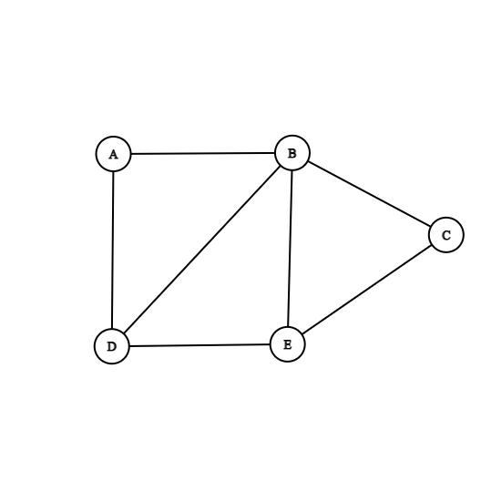
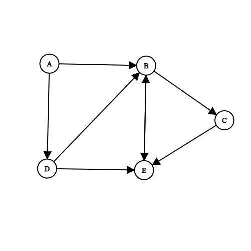
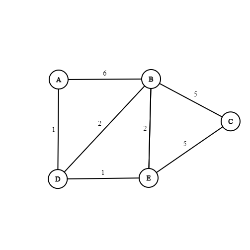

# Graphs Data Structure

## Terminology and Representation

### Uses of Graphs

- Navigation systems
- Web pages links
- Data transmission
- Social networks
- Fluid dynamics
- Critical path analysis
- 3D modelling
- Games and simulations

### What is a graph?
- Collection of interconnected nodes (there are no rules about how the nodes can be connected)
- Node = Vertex
- Vertices are connected by edges

- Usually n edges > n vertices
- Dense graph: a lot of edges in relation to the number of vertices
- Sparse graph: few of edges in relation to the number of vertices

### Undirected Graph (Unorded Graph or Graph)

- All the edges are bidirectional (Default)

### Directed Graph (Digraph

- Directional edges

### Weighted Graph

- Each edge of a graph can have a weight associate with it
- The weight is sometimes referred to as the cost
- The cost can represent different things, depending on the context
    - Speed limit
    - Diameter of a water pipe
    - Number of hours to complete a phase of a project

### Path
- Sequence of vertices in a graph
- Cycle is a path in which the starting vertex is also the ending vertex

### Representing a Graph

#### Directed Graph:

- Mathematical set notation: 
    - G = (V, E) 
    - V = {A, B, C, D, E} 
    - E = {(A,B), (A,D), (B,C), (B,E), (C,E), (D,B)}

#### Weighted Graph:

- Mathematical set notation:
    - G = (V, E) 
    - V = {A, B, C, D, E} 
    - E = {(A,B,6), (A,D,1), (B,C,5), (B,E,4), (C,E,5), (D,B,2), (D,E,1), (E,B,4)}

#### Undirected Graph:

- Mathematical set notation: 
    - G = (V, E) 
    - V = {A, B, C, D, E} 
    - E = {(A,B), (A,D), (B,A), (B,C), (B,D), (C,B), (C,E), (D,A), (D,B), (D,E), (E,B), (E,C), (E,D)}

### Implementation

#### Adjacency List
- Master list of vertices = {A, B, C, D, E}
- Each vertex cointains a list of adjacent vertices (neighbors)
    - A -> {B,D}
    - B -> {A,D,E,C}
    - C -> {B,E}
    - D -> {A,B,E}
    - E -> {D,B,C}

- Object Oriented Approach
    - Vertex Class
        - Properties:
            - Identifier
            - Information
        
    - The Master list of Vertex objects can be stored in a 1 dimensional array

- This method is very compact, space efficient representation of graph
- Recommended for sparse graphs

#### Adjacency Matrix
- Grid representation:
      A  B  C  D  E
    A    6     1 
    B 6     5  2  2
    C    5        5
    D 1  2        1
    E    2  5  1

- Can be implemented using a 2 dimensional array

- Object Oriented Approach
    - Vertex Class
        - Properties:
            - Identifier
            - Information

- The connectivity would be defined by the 2d array of edges
        0  1  2  3  4
        A  B  C  D  E
    0 A    6     1 
    1 B 6     5  2  2
    2 C    5        5
    3 D 1  2        1
    4 E    2  5  1

    - Graph(4,4)
        - Graph(0,1) = 6, Graph(0,3) = 1, Graph(1,0) = 6, ...

- Not space efficient
- For undirected graph, half of the information is just duplication

